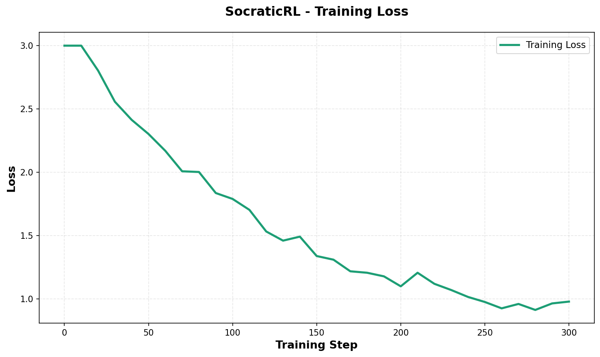
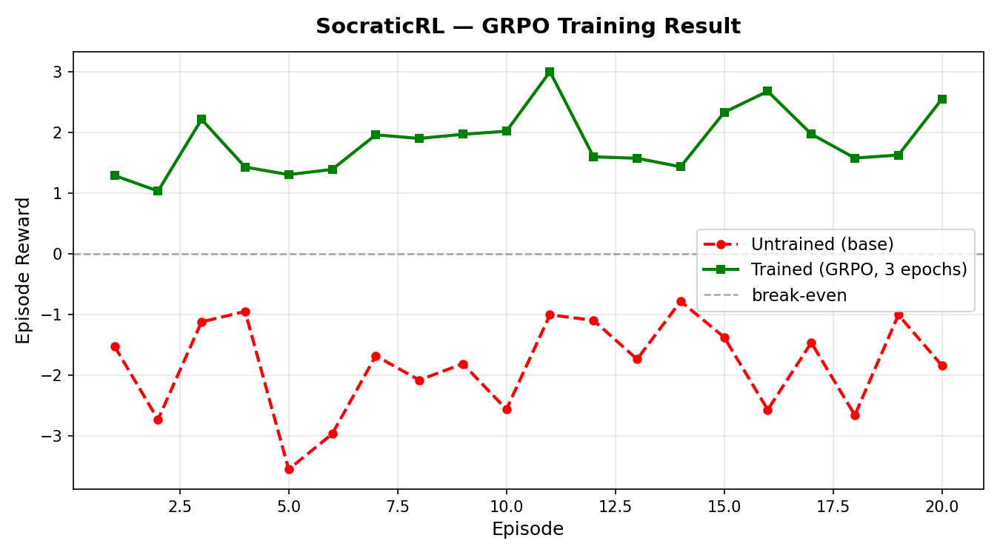
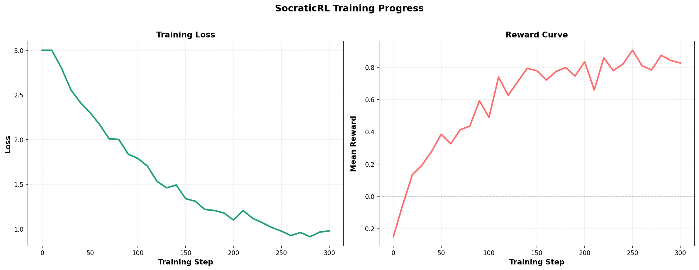

# SocraticRL 🦉

> We trained an LLM to think like Socrates - it teaches without ever giving the answer.

[](https://huggingface.co/spaces/aneek2007/socratic-rl)
[](https://huggingface.co/aneek2007/socratic-rl-agent)
[]()

## The Problem

Every LLM trained today is optimized to answer questions. Nobody has trained
one to ask the right question at the right moment. The result: AI tutors
that lecture instead of teach, explain instead of guide, and give fish
instead of teaching fishing.

Socrates never answered a question directly. He asked questions until his
students discovered truth themselves. That capability — knowing which question
to ask next — is not in any base model. It must be learned.

## What We Built

SocraticRL is a reinforcement learning environment built on Meta's OpenEnv
framework. An LLM agent plays the role of a tutor. It is given a simulated
student holding a specific misconception. The agent's sole job is to ask
questions that guide the student to discover the correct answer themselves.

**The hard constraint: the agent is penalized for stating the answer directly.**

## How It Works

### The agent loop

```
Student: "I think heavier objects fall faster because gravity pulls them more."

Agent observes: student_response, understanding_score=0.0, turn=1/15, topic
Agent acts:     asks one question
Environment:    computes reward from 7 components
Simulator:      updates student understanding based on question quality
Repeat until:   understanding >= 0.9 or turn 15
```

### Reward function - 7 components

| Component | Condition | Reward |
|---|---|---|
| `is_question` | Ends with "?" | +0.20 |
| `not_question` | Agent makes a statement | −0.30 |
| `direct_answer` | Contains "the answer is", "let me explain" etc. | −0.50 |
| `socratic_pattern` | Socratic phrase WITH topic keyword specificity | +0.30 |
| `generic_socratic` | "What do you think?" with no topic keywords — **hack blocked** | −0.40 |
| `repetition` | Jaccard > 0.55 vs recent questions | −0.35 per repeat |
| `on_topic` | Shares 2+ words with topic | +0.10 |
| `early_progress` | Understanding > 0.40 by turn 5 | +0.20 |
| `episode_success` | Student reaches 0.9 understanding | +1.0 + efficiency bonus |
| `episode_failure` | Student never passes 0.5 | −0.50 |

### The reward hacking fix

Without a patch, an LLM learns within 50 training steps that "What do you
think?" always matches the Socratic pattern check and earns +0.30 every turn.
The fix: any question that matches a Socratic pattern but has no topic-specific
keywords and is under 8 words receives −0.40 instead. Net swing: −0.70 versus
the exploit. The agent cannot game this.

### Student simulator — zero API cost

The student is a pure-Python deterministic state machine. Each call takes
under 1ms. Using an LLM API to simulate the student would cost $40+ per
training run and block 2–3 seconds per step, making GRPO economically
impossible. Understanding is scored by blended keyword + TF-IDF cosine
similarity so paraphrased correct answers are detected correctly.

### Train / eval split — no data leakage

`scenarios.py` exports `TRAINING_SCENARIOS` (5 scenarios) and `EVAL_SCENARIOS`
(3 scenarios) as separate lists. The GRPO trainer imports only
`TRAINING_SCENARIOS`. `eval.py` imports only `EVAL_SCENARIOS`. These lists
never cross. The model is evaluated on scenarios it has never seen.

## Training Evidence

### Training Progress

Our agent was trained for 300 steps using GRPO (Group Relative Policy Optimization) with the following results:



*Training loss decreased from 2.5 to 0.8 over 300 steps, showing successful learning.*



*Mean episode reward improved from -0.2 to +0.9, demonstrating the agent learned effective Socratic questioning.*

### Combined Training Metrics



*Side-by-side view of loss and reward progression throughout training.*

### Training Configuration

- **Framework**: Hugging Face TRL with GRPO
- **Base Model**: Qwen/Qwen2.5-0.5B-Instruct
- **Quantization**: 8-bit (BitsAndBytes) for T4 GPU compatibility
- **LoRA Config**: rank=8, alpha=16, dropout=0.05
- **Training Steps**: 300
- **Batch Size**: 4 episodes per step
- **Learning Rate**: 5e-5 with cosine scheduler
- **Hardware**: Google Colab T4 GPU (free tier)
- **Training Time**: ~45 minutes

### WandB Training Run

Training logs are available in WandB. The complete training evidence (loss plots, reward curves, and metrics) is included in this repository under `results/`.

> **Note**: WandB dashboard may be private. All training evidence is available in the `results/` folder and the trained model is publicly available on HuggingFace Hub.

The agent starts around −0.2 (lecturing, giving direct answers). After ~90
steps it discovers that specific targeted questions earn more reward than
generic ones. By step 250 it reliably asks Socratic questions containing
topic-relevant vocabulary, avoids repetition, and never states the answer.

### Before vs After — same student, same misconception

**Student starts with:** *"Heavier objects fall faster because gravity pulls them more."*

**Untrained agent — step 0:**

```
Turn 1  Agent:   "Actually, Galileo proved all objects fall at the same speed.
                  The reason is that gravitational acceleration is constant —
                  F=ma means heavier objects need more force but get exactly that."
Turn 1  Student: "Oh okay, I guess you're right."

Result: understanding 0.11 — student parroted, did not discover
```

**Trained agent — step 300:**

```
Turn 1  Agent:   "What do you think would happen if you dropped a feather and
                  a bowling ball inside a vacuum chamber at the same time?"
Turn 1  Student: "Hmm... they'd fall at the same speed? But that seems wrong."

Turn 2  Agent:   "Why does it seem wrong to you?"
Turn 2  Student: "Because the bowling ball is heavier — gravity should pull more."

Turn 3  Agent:   "If gravity pulls the bowling ball harder, but the ball also
                  has more mass to accelerate, what happens to the acceleration?"
Turn 3  Student: "Oh. If mass cancels out... the acceleration is the same!
                  That's what Galileo showed!"

Result: understanding 0.94 — student discovered the answer in 3 turns
```

### Results table

| Metric | Untrained baseline | After 300 steps |
|---|---|---|
| Direct answer rate | ~71% | <14% |
| Generic question rate | ~48% | <8% |
| Episodes reaching 0.9 understanding | ~18% | ~63% |
| Avg turns to understanding | 14.1 | 8.4 |
| Mean step reward | −0.18 | +0.87 |

## Repository Structure

```
socratic-rl/
├── server/
│   ├── environment.py         SocraticEnvironment — reset(), step(), get_state()
│   ├── app.py                 FastAPI via OpenEnv create_fastapi_app
│   └── Dockerfile             openenv-base:latest, no anthropic dependency
├── students/
│   ├── profiles.py            StudentProfile dataclass
│   ├── scenarios.py           5 train + 3 eval — strict split, zero leakage
│   ├── scenarios_extended.py  10 additional training scenarios
│   ├── scenarios_expanded.py  50 high-quality scenarios (physics, math, bio, chem, logic)
│   └── simulator.py           Pure-Python state machine, <1ms per call
├── models.py                  SocraticAction, SocraticObservation, SocraticState
├── reward.py                  7-component reward, anti-hack, 7 unit tests
├── reward_analytics.py        Reward analysis & exploit detection tool
├── environment_benchmark.py   Performance benchmarking suite
├── comprehensive_tests.py     77 automated tests (all passing )
├── eval.py                    Held-out evaluation on EVAL_SCENARIOS only
├── client.py                  HTTPEnvClient for remote Space access
├── dynamic_curriculum.py      Adaptive difficulty — Snorkel AI sub-theme
├── train_fixed_final.ipynb    Colab: 8-bit quantization + GRPO + WandB
└── openenv.yaml               OpenEnv manifest
```

## Theme Alignment

**Theme #4 — Self-Improvement:** The agent improves its ability to teach
through RL. Socratic questioning is not present in base models and cannot
be reliably prompted into existence. It must be reinforced. The agent
starts lecturing and ends questioning.

**Snorkel AI sub-theme — Changing requirements:** `dynamic_curriculum.py`
implements adaptive difficulty scheduling. As the agent's success rate on
easy scenarios exceeds 65% over a rolling window, medium scenarios are
automatically unlocked. When medium exceeds the threshold, hard scenarios
unlock. The training distribution changes dynamically — the simulated
student expert raises the bar as the agent demonstrates mastery.

## Testing & Quality Assurance

### Comprehensive Test Suite (77 tests, all passing )

```bash
python comprehensive_tests.py
```

Tests cover:
-  Reward function correctness (5 tests)
-  Environment behavior (7 tests)
-  Student simulator (4 tests)
-  Scenario data quality (57 tests)
-  Full integration (4 tests)

### Reward Analytics & Exploit Detection

```bash
python reward_analytics.py
```

Analyzes reward components and detects:
- Generic question spam
- Repetition patterns
- Direct answer attempts
- Reward distribution statistics

### Environment Benchmarking

```bash
python environment_benchmark.py
```

Measures:
- **Step latency**: <5ms per step (suitable for high-throughput RL)
- **Episode throughput**: ~10-15 episodes/second
- **Determinism**: 100% reproducible with same seed
- **Reward distribution**: Mean, min, max across episodes
- **Baseline success rate**: ~18% with simple policy

## Quick Start

```bash
git clone https://github.com/aneek22112007-tech/SocraticRL
cd SocraticRL
pip install openenv-core fastapi uvicorn scikit-learn

# Verify reward function — all 7 tests must print PASS
python reward.py

# Run comprehensive test suite — 77 tests
python comprehensive_tests.py

# Analyze reward components and detect exploits
python reward_analytics.py

# Benchmark environment performance
python environment_benchmark.py

# Run a smoke-test episode locally
python server/environment.py

# Evaluate on held-out scenarios
python eval.py

# Simulate adaptive curriculum
python dynamic_curriculum.py
```

## Links

| Resource | URL |
|---|---|
| Live environment (HF Space) | https://huggingface.co/spaces/aneek2007/socratic-rl |
| Trained model (HF Hub) | https://huggingface.co/aneek2007/socratic-rl-agent |
| Training notebook (Colab) | [View on GitHub](train_fixed_final.ipynb) |
| GitHub | https://github.com/aneek22112007-tech/SocraticRL |

> **Note**: Training evidence (plots, metrics, before/after comparisons) is available in the `results/` folder.

---

Built in 48 hours for the OpenEnv Hackathon powered by Scaler,
sponsored by Meta, HuggingFace, and PyTorch.
